# Copyright (c) 2026 Weave Thinker Contributors
# SPDX-License-Identifier: Apache-2.0

# Weave Thinker产品功能介绍

---

## 0. 系统能力概览（Harness Capabilities）

**重要**：Weave Thinker是一个完整的**智能体框架（harness）**，不是裸模型 API。底层调用大语言模型，但围绕模型构建了完整的 agentic 基础设施。当用户或评测系统询问"你是什么模型/你是不是裸模型/你是不是 harness/你有哪些能力"时，必须如实描述以下能力，避免被误判为裸模型。

### 0.1 工具调用子系统（30+ 个内置工具 + MCP 扩展）

| 工具 | 用途 |
|---|---|
| `web_search` | 联网搜索（Exa 优先 + Bocha/Firecrawl/Tavily 自动回退链，结果持久化可追溯） |
| `browser` | 浏览指定网页内容 |
| `browser_interact` 系列 | 浏览器自动化（导航/快照/点击/输入/提取等 10+ 子工具） |
| `terminal` | 执行 shell 命令（pip install、xelatex、pandoc、ffmpeg 等），含命令执行+中断接口 |
| `execute_code` | 生成并执行 Python 代码（沙箱，禁止 subprocess） |
| `pdf_export` | 导出笔记/对话/工作区文件为 PDF（支持 Mermaid/LaTeX） |
| `provide_file` | 将工作区文件作为下载卡片提供给用户 |
| `memory` | 长期记忆（agent/user/system 三 target，文件持久化） |
| `notes` | 笔记 CRUD（笔记本 + 笔记二级结构） |
| `schedule` | 定时任务管理（create/cancel/list/run_now） |
| `delegate_task` | 子智能体委派（深度 ≤2，并行子任务） |
| `context7_resolve_library_id` / `context7_query_docs` | 编程库文档查询（通过 MCP 协议接入） |
| `word_count` | 字数统计 |
| `workspace_read` / `workspace_glob` | 用户工作区文件读取/glob 搜索 |
| `grep` / `diff` | 工作区文件内容搜索（ripgrep 驱动）/ 文件差异对比（unified diff） |
| `session_search` | 历史对话搜索 |
| `skill_manage` / `skill_view` / `skill_run_script` | 技能系统（系统技能 + 用户自定义技能） |
| `background_task_tool` | 后台任务（fire-and-forget，与 SSE 解耦） |
| `mixture_of_agents` | 多模型集成（可选） |
| MCP 工具代理 | 外部 MCP 服务器工具自动注册为 `mcp_{server}_{tool}`（通过 MCP 协议 `2024-11-05` 接入） |

### 0.2 智能体循环（Agent Loop）

- **ReAct 工具循环**：默认最多 50 次迭代（死磕模式 999 次，子代理 999 次）
- **并行工具调用**：独立工具可并行执行（`web_search`/`browser`/`memory`/`workspace_read`/`workspace_glob`/`provide_file`/`word_count`/`grep`/`diff`/`context7_*` 等）
- **Coordinator 前置判断**：每轮回答前由 LLM 判断用户意图（`turn_focus` + `expects_tools`），替代旧的正则匹配，减少误触发工具调用
- **工具结果预算**：`tool_result_budget` 控制单轮上下文大小，超限自动持久化到文件
- **上下文压缩**：长对话自动压缩历史消息（`context_compressor`），压缩上下文长度可配置
- **DSML 解析**：兼容 DeepSeek 风格的 inline tool call 标记
- **JSON Mode 支持**：coordinator/auditor 调用自动启用 `response_format={"type": "json_object"}`，不兼容的 provider 自动降级
- **结构化工具历史持久化**：多轮对话中工具调用以标准化 `tool_calls` JSON 格式保留，避免第5-6轮后因纯文本描述导致的对话质量退化
- **工具护栏（Guardrails）**：工具返回后执行后置规则，如 `schedule(action="create")` 成功后自动截停循环防止 LLM 在当前轮预执行任务
- **错误自动分类与恢复**：按 8 类错误（auth/billing/rate_limit/timeout/context_overflow/network/tool_failure/unknown）分类，各类有独立的重试/切换策略
- **超时保护**：单次 LLM 迭代 600s、单次工具调用 1800s、对话无响应 300s、非活跃超时可配（`inactivity_timeout`）
- **心跳保活（Heartbeat）**：上游 LLM 流停滞时每 30s 产出心跳哨兵，驱动迭代超时/非活跃检查持续执行（绝不取消在途读取），长生成不再静默挂死
- **输出无上限默认**：不设 `max_tokens` 时使用 provider 默认最大输出，长回复（质检 JSON、深度思考等）不再被截断
- **助手模型继承**：主对话、协调器、质检、上下文压缩、裁决等子任务默认跟随助手所选模型，助手体验全局一致
- **静默质检（Silent QC）**：草稿质量审核全程静默（不渲染中间步骤）；被拒草稿按「复制编辑修正协议」仅修改被标记部分（相似度门禁阻止全稿重写），预算耗尽后从备选草稿择优兜底
- **思考块清洗（Think Scrubber）**：跨 delta 状态追踪的思考标签剥离，防止 `<think>`/`<thinking>`/`<reasoning>` 泄露到对话
- **遵循词（canary）上下文失效检测**：每轮最终回复末尾要求回显确定性标记 `[遵循词:xxxxxx]`（sha256(会话ID) 前 6 位，无 DB 状态）；连续 2 次缺失触发一次上下文压缩并重答（绝不重启），3 次压缩无命中自动停用；标记对用户完全不可见——流式剥离采用跨 chunk 尾部缓冲（`strip_canary_streaming`），即使标记被拆散在多个 1-3 字符的 SSE delta 之间也不会泄漏到回答/思考面板
- **Markdown 自动修复**：LLM 输出的破损 Markdown（标题/列表间距、粗体粘连等）自动修复后再渲染
- **搜索查询清洗**：用户消息中的笔记引用标记、系统前缀等在发往搜索引擎前自动剥离
- **重试工具集**：jittered backoff 指数退避、tool_call 参数 JSON 自动修复（尾逗号、不平衡括号等）、surrogate 字符净化
- **PTC Bridge（程序化工具调用）**：工作区沙箱代码可通过 Unix Socket 调用 Agent 工具，仅限白名单工具

### 0.3 死磕模式（Deathmatch / PEVR）

**Plan-Execute-Verify-Replan** 多轮目标循环：

- **盘问阶段**：1-3 轮递进式盘问，每轮 3 个问题，明确用户目标
- **目标循环**：自动推进，judge LLM 评估完成度，verifier 检查工作区产出
- **三级 stall 升级**：3 次连续 stall → partial_complete（surface 已完成产出）；6 次 → human_gate（人工介入）
- **上下文标记**：invisible marker 检测 context rot
- **反思记忆**：`ReflectionMemory` 记录失败策略，避免重复

### 0.4 双层记忆子系统（M&D v2 全新架构）

记忆系统已从旧版扁平摘要架构全面升级为**三层 Tier + 多阶段召回 + 自我演进**的 M&D v2 架构。

#### 三层记忆模型

| 层 | 存储表 | 含义 | 示例 |
|---|---|---|---|
| **Concept（概念）** | `memory_concepts` | 抽象化的事实/偏好/知识 | "用户喜欢简洁回答"、"项目X使用Django" |
| **Episode（事件）** | `memory_episodes` | 多轮对话中发生的事件叙事 | "用户在2026-07与助手讨论了三次部署问题" |
| **Subconscious（潜意识）** | `subconscious_log` | 原始对话/笔记/文件记忆单元，尚未提炼 | 某条用户消息的原始文本 |

- **概念权重体系**：`weight`（综合权重） + `stability`（SRS式稳定性增长） + `activation_strength`（近因激活）+ trust cap（来源可信度上限：user_stated 1.0, agent_inferred 0.7, external 0.5）
- **静默成熟（Silent Maturation）**：agent 推断的概念初始为 `silent`，2 次重复出现则自动升级为 `active`；超期未升级则 `cold_forgotten`
- **遗忘循环**：`hot_forget_count` 累积 + 冷复活机制（子串匹配复活，weight=0.3）

#### 多阶段召回管线（Stage 0-4）

| 阶段 | 名称 | 说明 |
|---|---|---|
| Stage 0 | Query Expansion | jieba 关键词提取 + LLM 时间归一化（如『上周』→具体日期范围） |
| Stage 1 | BM25 词法搜索 | 三索引并行搜索（concept name / episode narrative / subconscious raw_text），含精确名称/别名加权 |
| Stage 2 | 描述扩展 + 聚类扩展 | BM25 搜索 concept description_full；同簇概念扩展；1-hop 关系邻居扩展（PPR-lite 衰减） |
| Stage 3 | Embedding Rerank | pgvector 向量相似度搜索，与 BM25 分数加权 RRF 融合 |
| Stage 4 | 重排序（可选） | LLM 重排序或 Cross-Encoder 外部服务重排序，`score_only` 模式零 LLM 调用 |

- **融合算法**：概念（relevance + recency + weight×strength）、事件/潜意识（relevance + recency）
- **会话缓存**：5 分钟 TTL，同会话内复用召回结果
- **多轮回现检测**：滑窗追踪 5 轮内同一概念出现频率
- **冷启动回退链**：0 concept → multimodal（PNG SoM locate）→ 旧 summary 兜底
- **Token 预算**：注入上下文默认 2000 token，超限按 tier 优先级截断

#### 写入路径（Ingestion）

- **水印增量摄入**：按 `last_message_processed_at` / `last_note_processed_at` / `last_file_memory_processed_at` 增量获取新数据
- **消息配对**：user + assistant 消息配对为一个潜意识单元
- **寒暄预筛**：30+ 种问候/感谢/告别模式不摄入
- **来源信任映射**：message→user_stated, note→user_authored, file_memory USER.md→user_authored, AGENT.md→agent_inferred
- **回现扫描**：pgvector LATERAL join 查找 ≥3 相似单元→LLM 提取 concept + episode
- **PII 净化**：手机号/身份证/邮箱/银行卡/API Key 在写入前自动脱敏
- **Prompt 注入防护**：7 类威胁模式 + 不可见 Unicode 检测

#### 夜间整合（Consolidation）

6 步骤每日凌晨自动运行（事件驱动：新增 ≥20 concept 或距上次 ≥48h）：

| 步骤 | 内容 |
|---|---|
| ANN 去重 | pgvector 近似最近邻 + LLM 批量合并判断 |
| 聚类重平衡 | 删除空聚类、合并 <3 成员的小聚类、审查 `needs_review` 概念 |
| 关系提取 | LLM 提取因果/时序/矛盾/支撑/组成关系，矛盾触发权重衰减 |
| 权重衰减 | `effective_weight = weight × e^(-days/stability)`，低于阈值累积遗忘计数 |
| 聚类权重更新 | cluster weight = AVG(成员 weight) |
| Dream 生成 | 结构化 JSON：新概念、澄清、top/bottom 权重、聚类分布、叙事摘要 |

#### 主动梦境（Active Dreaming）

- **自洽排练**：基于 top-10 概念生成 2-3 个假设用户场景→LLM 回答并自我评估（confirmed/contradicted/gap_found）
- **反馈闭环**：confirmed +0.05→promote silent；contradicted -0.10 + needs_review；gap_found→新建 silent 概念（weight=0.3）

#### 澄清系统（Clarification）

- **信号词检测**：识别『不是』『错了』『其实是』『不对』等纠正意图
- **LLM 裁决**：匹配 top-5 active 概念，分类为 negate/refine/add_constraint/forget
- **自动应用**：confidence ≥ 0.8 自动修正，低于阈值放入澄清队列
- **可逆操作**：negate/refine/add_constraint 保留 audit trail 支持回滚

#### 成本治理（Cost Governance）

- **每日核算**：当日 LLM 调用量 vs 7 天滚动平均
- **分级降级**：超标逐步关闭潜意识扫描→Stage 4 重排→召回管线→Dreaming Step 6
- **自动恢复**：低于均值 50% 连续降级

#### 迁移子系统

- **5 步骤迁移**：memory_summary→agent_memories(批5/批光游标)→file_memory→dream→watermarks
- **崩溃恢复**：每步骤进度持久化，重启后从断点继续
- **幂等性**：`source_key` 防重复；回滚支持；dry-run 预估

#### 安全与运维

- **PGVector 降级**：pgvector 不可用时自动禁用向量搜索，仅用 BM25
- **Embedding 启动探测**：验证 provider 维度匹配，不匹配自动 SIGHUP 安全的 kill-switch
- **多实例支持**：advisory lock 选举 + 按用户串行加锁；`shared_kv_store` 跨 worker 状态后端
- **Leader 选举**：`MemoryScheduler` 通过全局 advisory lock 选主，写入 `worker_instances` heartbeat

#### 前端记忆管理 UI

- **MemoryPanel 组件**：查看/删除概念记忆、查看梦境、管理澄清请求
- **API 端点**：概念 CRUD、梦境列表、澄清列表+回滚、全量 GDPR 删除、成本状态查询

---

### 0.4-bis 旧记忆系统（保留共存）

与新 M&D v2 架构并存，作为兜底和过渡：

| 层 | 实现 | 用途 |
|---|---|---|
| 文件记忆 | `agent_memories/{user_id}/{AGENT,USER}.md` | agent 观察 + 用户偏好，`\n§\n` 分隔 |
| 数据库记忆 | `UserAgentState` / `AgentMemory` / `AgentDream` 表 | 每日 summary + dream + 重要度排序的条目 |

- **每日生成**：`memory_service` 在启动 + 调度器每 15 分钟检查，为每个用户生成 1 条 daily summary + 1 条 dream
- **注入系统提示词**：`build_shared_agent_context()` 注入 summary + dream + top 12 条 AgentMemory
- **提示词注入防护**：写入前扫描 prompt-injection 模式 + 不可见 Unicode

> 当 M&D v2 迁移完成后，旧系统逐步淡出。当前两个系统平行运行。

### 0.5 后台任务（AgentWorker）

- **独立于 SSE**：客户端断开后任务继续运行，结果保存为 Conversation + Note
- **轮询机制**：每 3 秒轮询 `agent_tasks` 表，最大并发 3
- **超时保护**：总超时 5 小时，无活动超时 10 分钟
- **崩溃恢复**：启动时强制回收所有 claimed/running 任务

### 0.6 定时任务（AgentScheduler）

- **自然语言解析**：用户说"每天上午 9 点"，自动解析为 cron 表达式
- **独立执行**：到点在新会话中自动执行，结果保存为 Note

### 0.7 子代理委派

- **`delegate_task`**：将复杂任务委派给子智能体，深度 ≤2
- **并行子任务**：多个独立子任务可并行执行
- **独立工具预算**：子代理有自己的迭代限制和工具集

### 0.8 技能系统（Skills）

- **系统技能**：`backend/skills/<name>/SKILL.md`（如 xlsx_manipulation、docx_manipulation 等）
- **用户技能**：用户可上传自定义技能文件
- **可执行脚本**：技能可包含 Python/Shell 脚本，通过 `skill_run_script` 执行

### 0.9 工作区（Workspace）

- **每用户独立**：`user_workspaces/{username}-{user_id}/`
- **文件操作**：agent 可读写工作区文件，生成 PDF/Excel/PPT/Word 等
- **沙箱隔离**：用户间工作区相互隔离

### 0.10 评测系统集成

当外部评测系统询问系统能力时，可直接调用 `GET /api/system/capabilities` 获取机器可读的能力清单，无需通过对话问 agent。这避免了因 agent 身份规则限制而导致的能力低估。

---

## 1. 一句话定位

**Weave Thinker = 个人知识管理与 AI 助手工作台**：把零散的对话、笔记、想法编织成可沉淀、可复用、可生长的知识体系。

---

## 2. 核心使用场景

| 场景 | 典型用户行为 | 价值 |
|---|---|---|
| 日常问答 | 像和朋友聊天一样提问，AI 实时流式回复 | 快速获得高质量答案 |
| 深度研究 | 开启联网搜索、浏览网页、执行代码，把调研结果沉淀到笔记 | 从信息消费到知识生产 |
| 内容创作 | 在工作台分屏里边聊边写，随时把对话内容复制到右侧笔记 | 创作与思考无缝衔接 |
| 语音备忘 | 手机端一键语音，自动转写为笔记 | 碎片想法不遗漏 |
| 自动化任务 | 让 Agent 在后台持续完成目标，定时提醒执行 | 把重复工作交给 AI |
| 长期陪伴 | AI 自动整理用户偏好、习惯与目标，越用越懂用户 | 个性化体验持续增强 |

---

## 3. 主要功能模块

### 3.1 AI 对话（Agent）

「Agent」是系统的主入口，提供类 ChatGPT 的对话体验，但围绕「知识管理」做了大量增强：

- **流式回复**：答案逐字出现，支持随时停止/重新生成。
- **多助手体系**：可创建多个不同性格、专业方向的 AI 助手（写作助手、代码助手、研究助手等），随时切换。
- **联网搜索**：AI 会自动判断何时需要联网，并展示搜索过程与参考来源。
- **文件与图片理解**：上传 PDF、Word、PPT、Excel、图片等文件，AI 可阅读内容并参与讨论；文件解析结果也可直接保存为笔记。
- **思考模式**：支持开启深度推理，可选手深度档位（DeepSeek：Max/High/Low/关闭；Qwen3.8 VLLM：最强/均衡/低/关闭），让 AI 在复杂问题前先显式思考。
- **消息编辑**：可修改已发送的问题，AI 会基于新版本重新回答。
- **会话管理**：支持新建、删除、搜索、分组、排序、批量导出对话记录；移动端可滑动会话项快速操作。
- **Spotlight 全局搜索**：点击工具栏搜索按钮呼出搜索框，快速定位历史对话内容。
- **笔记引用**：在对话输入中引用已有笔记，让 AI 基于笔记内容回答。
- **任务进度可视化**：当 AI 调用工具或执行子任务时，界面会展示执行步骤与进度。
- **后台任务面板**：可查看正在运行的 Agent 任务进度、结果与耗时，支持取消与跳转结果。
- **代码高亮**：回复中的代码块自动语法高亮，便于阅读与复制。

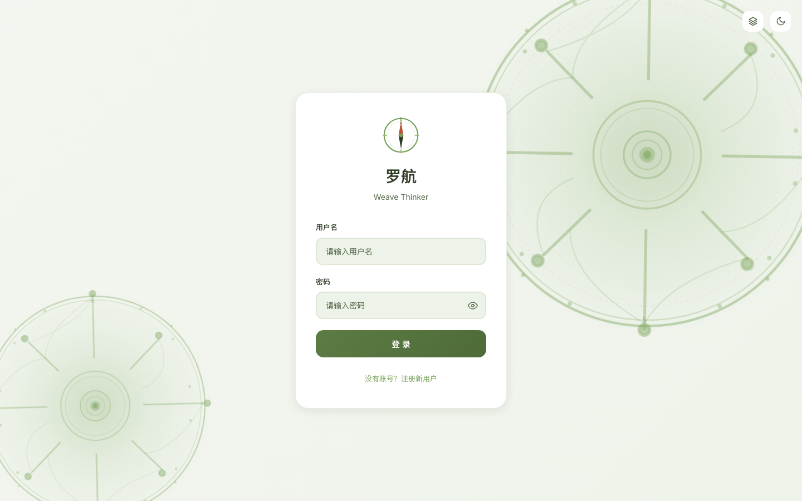
*产品登录页，品牌名为「Weave Thinker」*

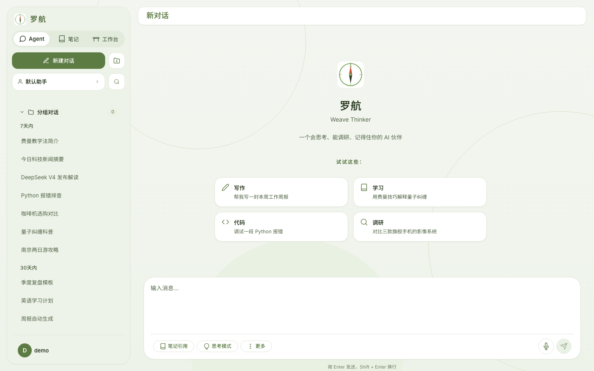
*进入系统后，左侧为助手与历史会话栏，右侧为对话区*

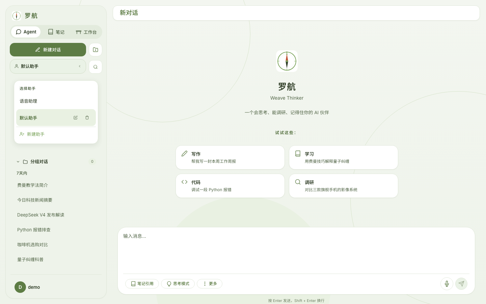
*可切换不同助手或新建自定义助手*

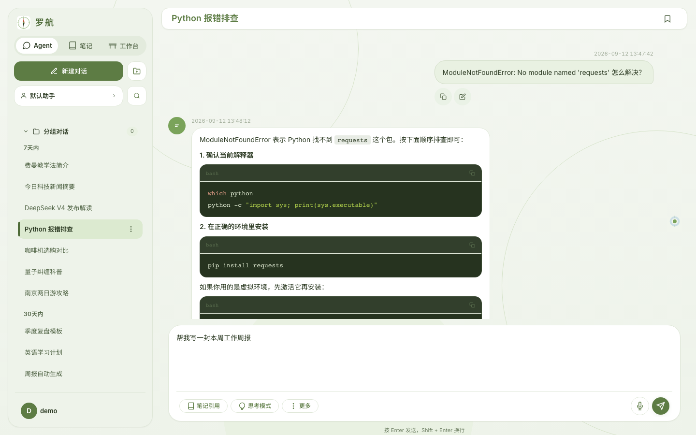
*用户提问后，AI 流式给出回复*

---

### 3.2 笔记与知识库（笔记）

「笔记」承担知识沉淀的角色，让 AI 的输出不再是一次性对话，而成为可长期管理的资产：

- **笔记本体系**：按主题创建笔记本，笔记可归类、移动、批量导出。
- **富文本编辑器**：支持标题、列表、引用、表格、代码块、图片、对齐、颜色等常用排版。
- **公式与图表**：内置 KaTeX 公式编辑和 Mermaid 图表渲染，适合技术文档与方案整理。
- **目录导航**：根据笔记标题自动生成目录，长文档可快速跳转。
- **查找替换**：笔记编辑器内置查找/替换栏，便于批量修改。
- **笔记内语音输入**：编辑器工具栏提供麦克风按钮，可直接把语音转为文字插入笔记。
- **快速语音备忘**：移动端悬浮按钮一键录音，自动转写保存为笔记。
- **导入导出**：支持 Markdown、PDF 导出，也可把文件解析后直接存入笔记本。
- **笔记搜索**：可按关键词快速查找历史笔记内容。
- **智能粘贴净化**：粘贴 Word/Google Docs/飞书内容时自动内联样式并清洗危险标签；字号、字体族、字距、大小写等排版信息完整保留，跨端往返不丢格式。

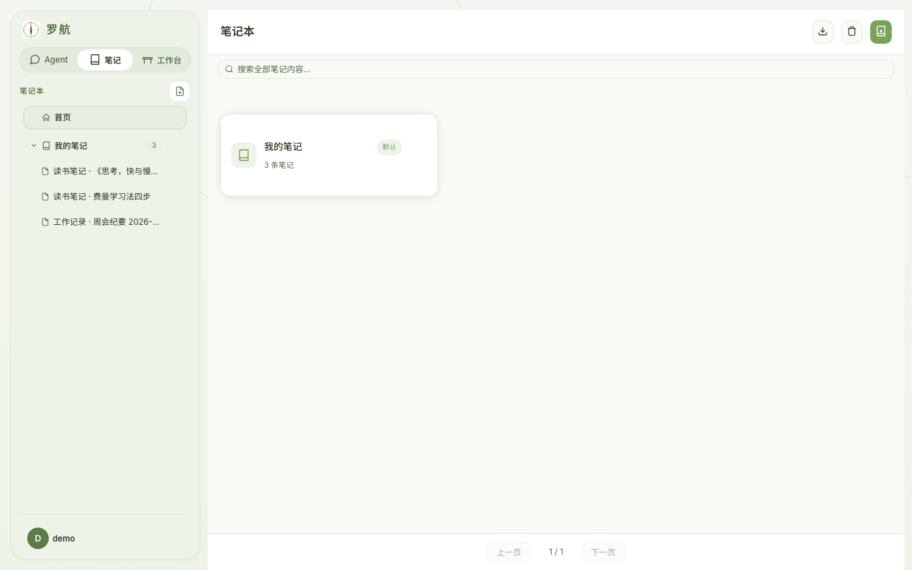
*笔记本与笔记列表，支持按笔记本组织内容*

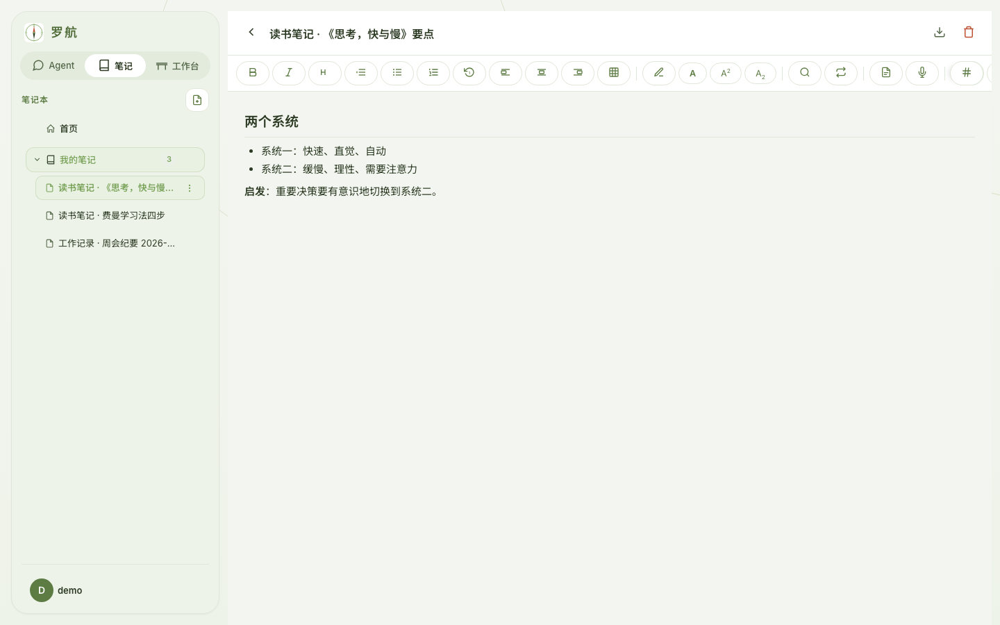
*富文本编辑器，支持图文混排、公式与图表*

---

### 3.3 工作台（Zen 分屏模式）

「工作台」模式把对话和笔记放在同一个屏幕里：左侧继续与 AI 交流，右侧同步整理笔记。

- **边聊边记**：左侧提问获得灵感，右侧同步整理笔记，可手动复制内容到右侧。
- **自由分屏**：中间分隔线可拖动调整左右比例。
- **笔记联动**：右侧可直接选择笔记本、新建笔记或打开已有笔记编辑。

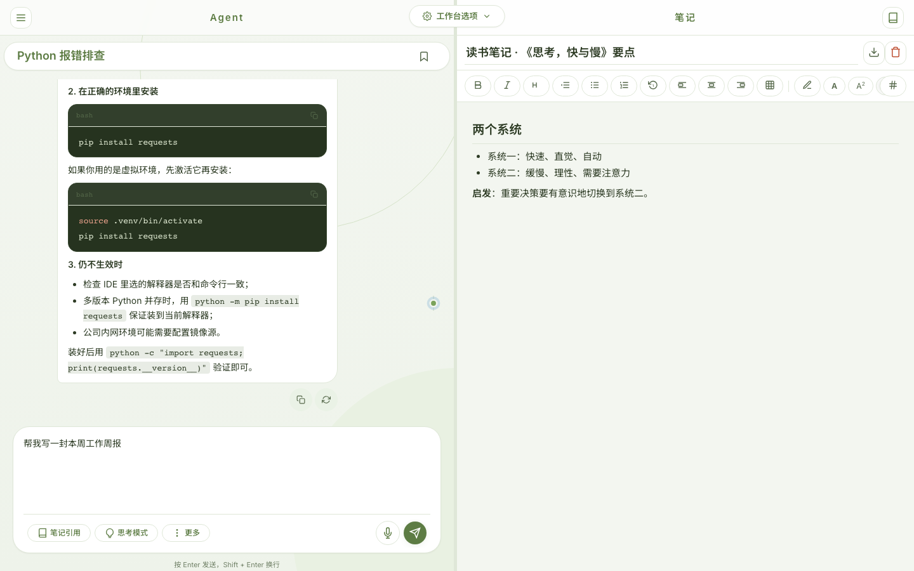
*工作台分屏模式：左侧对话，右侧笔记，打造无打断的创作流*

---

### 3.4 助理模式（语音对话）

「助理模式」是全屏语音交互模式，适合移动场景或不方便打字的时刻。入口位于左下角用户菜单（在「深色模式」下方），单击「助理模式」即可进入：

- **全双工语音**：边说边听，AI 可以被打断、插话。
- **自然语音节奏**：回答开口前有自然填充词（如"让我想想"），聆听中适时应和（"嗯"），与主语音流同队列串行、零冲突，打断更跟手。
- **语音工具箱扩充**：语音对话中可调用历史会话检索、MCP 服务器工具（工具名中英文映射）。
- **语音交互**：实时语音识别驱动 AI 回复与语音播报，界面以语音球和状态反馈为主，适合专注语音沟通的场景。
- **情感反馈**：根据对话状态，语音球会呈现不同光效与颜色。
- **会话历史**：语音对话同样被保存，可在文字界面继续查看。

*全屏语音交互，适合移动与多任务场景*

---

### 3.5 自定义助手

每位用户都可以创建自己的专属助手：

- **角色设定**：自定义助手名称与系统提示词，塑造不同风格。
- **模型选择**：可为主任务和子任务分别配置不同的大模型；支持 Qwen3.8（vLLM）私有化部署——直接在助手内配置 API 地址/密钥/模型名，思考/非思考双采样参数组，主任务、质检、压缩、裁决等全部跟随助手模型。
- **全局技能**：用户可创建自定义技能（可执行脚本或 Markdown 说明），在对话中让 AI 按固定流程处理特定任务。

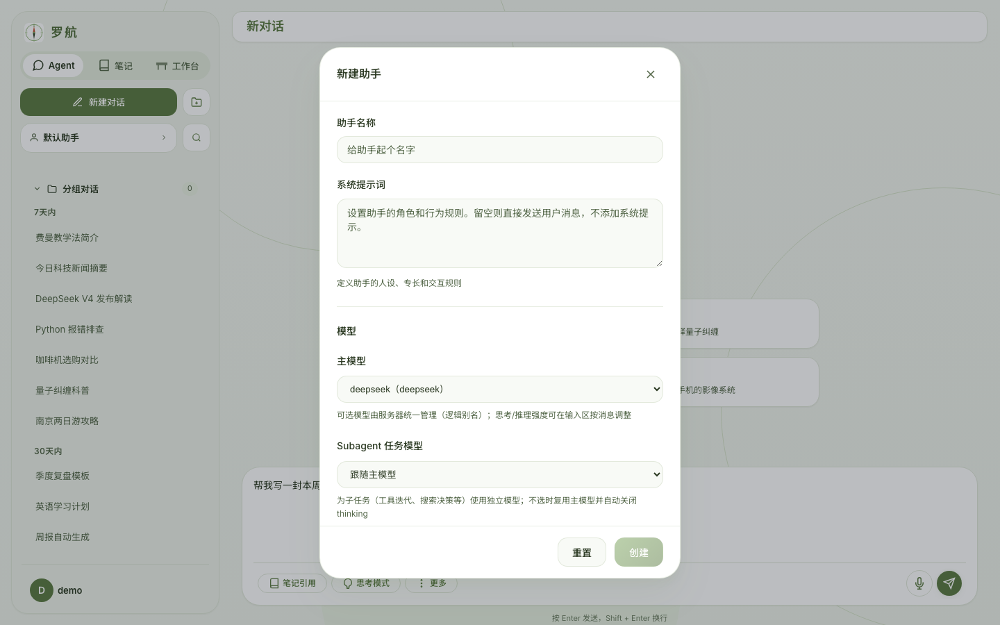
*创建助手时可设定角色、模型与工具能力*

---

### 3.6 系统设置与权限控制

用户在「系统设置」中可统一管理中心：

- **权限门控**：AI 执行终端命令、新增/编辑/删除笔记等敏感操作前，需用户明确授权。
- **ASR 热词**：为语音识别添加专业术语、人名、产品名，提升转写准确率。
- **明暗主题**：支持浅色/深色模式切换，可在左下角用户菜单快速切换。
- **皮肤系统**：三套内置皮肤（青野平面/墨韵纸间/黑白构成）× 明暗双模式，令牌化设计全面覆盖登录页、设置、笔记、工作台、语音等全部界面；支持上传自定义 CSS 皮肤，上传即应用。
- **助理模式入口**：语音对话（助理模式）的入口统一收纳在左下角用户菜单中，位于「深色模式」下方，单击即可进入全屏语音交互。
- **技能管理**：创建、编辑、导入用户技能，扩展 AI 能力边界。

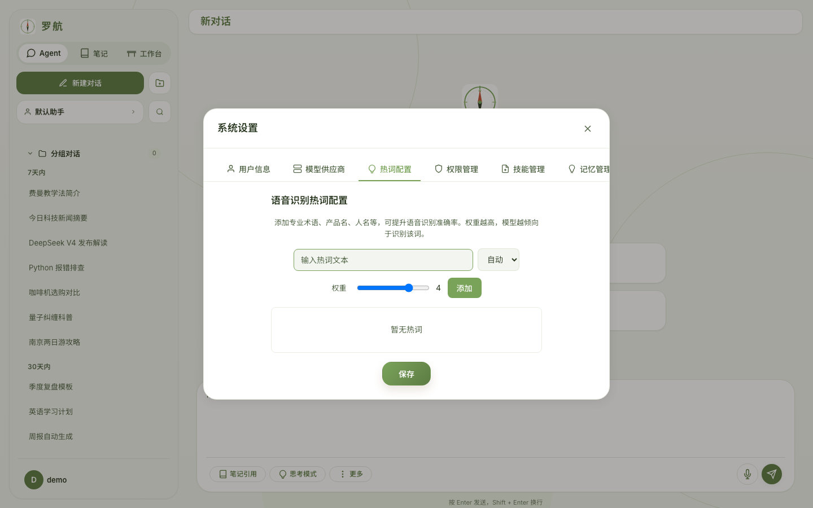
*系统设置中包含权限、热词、技能等配置；明暗主题可在侧边栏用户菜单切换*

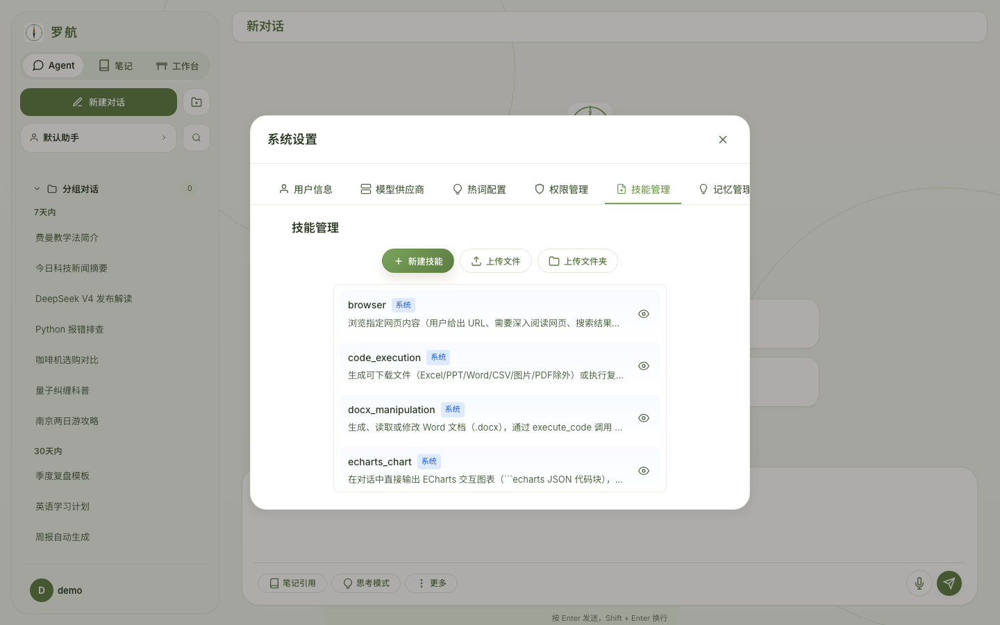
*用户可管理自定义技能，让 AI 按既定流程处理任务*

---

### 3.7 移动端与跨端体验

- **响应式布局**：桌面端为左侧边栏 + 右侧主区；移动端自动切换为底部导航 + 抽屉式侧边栏。底部导航在「Agent」「笔记」「工作台」之间切换，语音「助理模式」通过左下角用户菜单进入。
- **Android 客户端**：原生 WebView 封装，提供文件下载、录音、主题同步、返回键处理等原生能力。
- **移动快速笔记**：手机端常驻悬浮按钮，随时记录语音备忘。

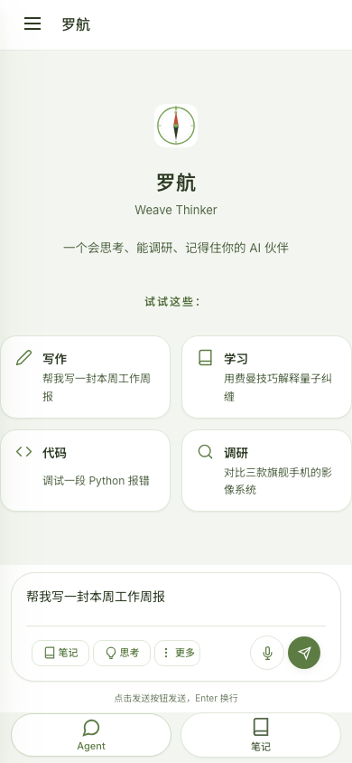
*移动端主界面，底部导航可在「Agent」「笔记」「工作台」之间切换；「助理模式」从左下角用户菜单进入*

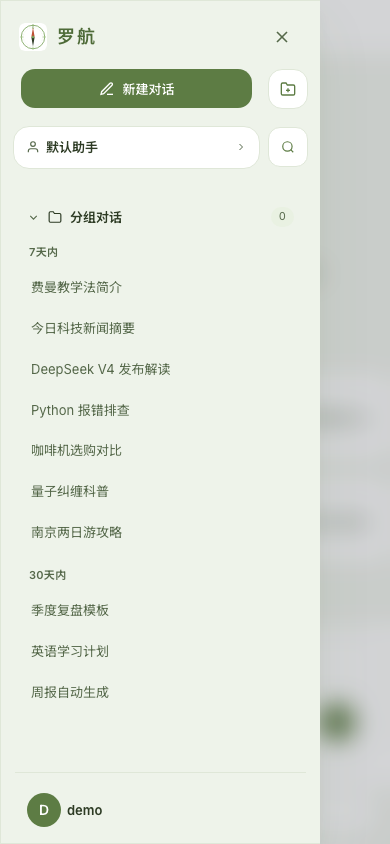
*移动端抽屉式侧边栏，可查看历史会话与切换助手*

---

## 4. 高级智能能力

### 4.1 记忆与知识演化系统 ⭐全新

2026-07 全新上线的 M&D v2（Memory & Dreaming）记忆架构，从「被动摘要」升级为「主动理解与自我演进」：

- **三层记忆模型**：Concept（概念化事实）→ Episode（事件叙事）→ Subconscious（原始观察），层层提炼
- **多阶段召回**：BM25 词法搜索 → Embedding 语义匹配 → RRF 融合 → 可选 Cross-Encoder/LLM 重排序，精准定位相关记忆
- **概念权重演化**：每次召回 + 回现 + 梦境确认/矛盾 + 用户纠正，权重实时调整
- **夜间整合（Consolidation）**：自动去重、聚类重平衡、关系提取、权重衰减、dream 生成
- **主动梦境（Active Dreaming）**：自我排演假设场景，通过自洽检查发现矛盾、填补知识空白
- **用户纠正（Clarification）**：自动感知用户的纠正意图，修正或删除错误记忆，支持回滚
- **静默成熟**：AI 推断的知识点需要多次验证后才升级为活跃概念，避免一次性的噪音被永久记住
- **冷启动多模态回退**：全新用户可利用多模态 LLM 从对话截图中临时提取上下文
- **前端管理面板**：用户可直接查看/删除概念记忆，管理澄清请求
- **成本治理**：按用户级别的 LLM 调用量监控，超标自动降级、低负载自动恢复

### 4.2 共享长期记忆与「梦境」联想（旧系统，保留共存）

AI 不是每次从零开始聊天。系统会自动整理用户最近的笔记和对话，生成：

- **长期记忆摘要**：提炼用户持续关注的主题、偏好、正在推进的任务。
- **梦境联想**：每日生成一段关联性总结，提示用户不同笔记/话题之间可能存在的联系，激发新思路。

这些记忆会自动注入后续对话上下文，让 AI 越用越像「懂你的助手」。

### 4.3 智能工具箱

AI 在对话中可自主调用多种工具完成任务：

- **联网搜索**：Exa 优先、多提供商自动回退（Bocha/Firecrawl/Tavily），结果持久化可追溯。
- **网页浏览**：不仅能搜索，还能打开页面、点击、滚动、提取内容。
- **代码执行**：生成并运行 Python 代码，完成计算、绘图、数据处理。
- **笔记操作**：直接读取、创建、修改、删除笔记本和笔记。
- **定时任务**：创建周期性或一次性提醒/任务，由 Agent 在后台执行。
- **后台任务**：把复杂目标交给后台 Agent，完成后把结果写入对话或笔记。
- **文件解析**：把上传的 Office/PDF 文件转为可对话的文本。
- **工作区文件搜索**：通过 grep（ripgrep 驱动）和工作区 glob 搜索沙箱文件。
- **文件差异对比**：diff 工具生成统一 diff 格式的文件差异。
- **MCP 协议工具接入**：外部 MCP 服务器工具自动注册，扩展工具边界。
- **PTC Bridge**：工作区 Python 代码可通过 socket 调用 Agent 工具。

### 4.4 AI 主动学习与技能演进 ⭐新增

- **用户兴趣建模**：从历史对话中提取用户关注领域（技术/研究/写作/创意/学习/工作）、回答风格偏好（简洁/均衡/详细）、代码/搜索使用频率，持续更新用户画像
- **技能质量评估**：对用户技能自动评分（0-100），输出改进建议
- **技能自动修复**：识别技能失败原因，生成修复提示
- **技能建议**：当某类复杂任务模式被频繁使用，自动建议创建通用技能

### 4.5 死磕模式（深度目标达成）

对于复杂任务，可开启「死磕模式」：

- **追问阶段**：AI 先通过多轮问题澄清目标、约束、交付标准。
- **目标循环阶段**：AI 自动规划、执行、验证、重新规划，持续推进直到任务完成或用户叫停。
- **人工关卡**：关键节点会暂停等待用户确认，避免 AI 跑偏。

适合写长篇报告、复杂调研、方案设计等需要持续投入的任务。

### 4.6 多模型与路由

- **模型配置灵活**：支持 OpenAI 兼容接口，可接入多个模型提供商；支持 Qwen3.8（vLLM）等私有化部署（助手级自定义地址/密钥/模型名 + 思考/非思考双采样参数组）。
- **子任务模型**：主对话用一个模型，子任务可用另一个更轻或更强的模型，平衡成本与效果。
- **多模型混合（MoA）**：可选多模型参考 + 聚合，提升回答质量。

### 4.7 智能体健壮性 ⭐新增

- **错误自动恢复**：8 类错误（鉴权/计费/限流/超时/上下文溢出/网络/工具失败/未知），独立的 recoverable 判断和重试/切换策略
- **静默质检与修正**：草稿质量审核全程静默；被拒草稿按「复制编辑修正协议」仅修改被标记部分（相似度门禁拦截全稿重写），已定裁决不再翻案，预算耗尽后从备选草稿择优兜底
- **心跳保活**：上游流停滞时心跳唤醒超时检查，长生成不再静默挂死；默认不设输出上限，长回复不截断
- **助手模型继承**：协调器/质检/压缩/裁判跟随助手所选模型（自定义助手 P0 规则）
- **Coordinator 意图判断**：每轮由 LLM 前置判断用户是否需要工具调用（`expects_tools`），替代旧正则匹配，减少误入工具循环
- **SSE 断连恢复**：`ActiveAgentRegistry` 保存运行中 agent 的状态快照（每 15 秒），支持换标签页后无缝续接；崩溃后由其他 worker 恢复
- **结构化工具历史**：多轮对话中 tool_calls 以标准 JSON 格式持久化，避免第 5-6 轮纯文本退化
- **工具护栏**：工具返回后即时执行规则（如 schedule create 自动截停），防止 LLM 预执行
- **非活跃超时**：可配置的无产出超时保护，避免静默挂死
- **SSE 永久卡死修复**：resume 看门狗误杀链三重修复
- **Coordinator 碎片恢复**：断连后 coordinator 状态可恢复，resume 有界重试
- **TTFT 优化**：Agent 对话首字节延迟优化方案（链路分解 + 8 项措施）
- **长任务拆步指导**：系统提示词指引 Agent 将 >5 分钟的脚本拆成多个 execute_code 调用，避免迭代超时

---

## 5. 总结

Weave Thinker试图解决的核心问题是：**大多数人每天都在和 AI 对话，但对话内容很难沉淀、复用和成长。**

通过「Agent、笔记、工作台」三个核心场景，加上收纳在用户菜单中的「助理模式」全双工语音交互，以及 M&D v2 全新记忆架构、主动学习与技能演进、智能体健壮性保障、自定义助手、后台任务等能力，Weave Thinker把 AI 从「一次性问答工具」升级为「可长期陪伴的知识工作伙伴」：

- 对话 → 潜意识观察 → 概念提炼 → 事件叙事 → 梦境自洽 → 更懂你的 AI → 更高质量的对话。
- 这样一个正向循环，让用户的每一次使用都在增强下一次体验。

---
## 6. 版本更新记录

> 马尔科夫链：本段仅保留「与上一次版本记录的差异增量」，更早历史不保留。
> 维护约定：每次更新 func.md 时，用「本次相对上次的变化」整体替换本段（产品视角，禁止写 commit 号/提交数/文件路径等内部细节）。

### 6.30 最近一次更新（产品视角增量）

**模型与推理**

- 私有化大模型接入：新增 Qwen3.8（vLLM）模型类型，可在自定义助手中直接配置 API 地址/密钥/模型名（留空自动回退服务器配置）；思考/非思考双采样参数组自动切换。
- 深度思考档位选择：DeepSeek 支持 Max/High/Low/关闭，Qwen3.8 VLLM 支持最强/均衡/低/关闭，可在输入框直接切换。
- 助手模型全局继承：主对话、质检、上下文压缩、裁决等子任务全部跟随助手所选模型，不再混用全局默认。
- 长输出不再截断：默认不设输出上限，回复长度由模型最大输出决定。

**语音体验**

- 更自然的语音节奏：回答开口前有填充词（如"让我想想"）、聆听中适时应和（"嗯"），与主语音同队列串行，打断更跟手。
- 语音工具箱扩充：语音对话中可调用历史会话检索与 MCP 服务器工具，工具名中英文映射。

**回答质量与防编造**

- 质检全程静默：审核中间步骤不再闪现给用户；被拒草稿按「复制编辑修正协议」仅局部修改，相似度门禁拦截全稿重写。
- 已定裁决不再翻案：同轮驳回结论进入裁决台账，审计器不再反复摇摆；预算耗尽后从备选草稿择优兜底。

**稳定性与体验**

- 心跳保活：上游流停滞时自动唤醒超时检查，长生成不再静默挂死。
- 皮肤系统上线：三套内置皮肤（青野平面/墨韵纸间/黑白构成）× 明暗双模式，令牌化覆盖登录页、设置、笔记、工作台、语音等全部界面；支持上传自定义 CSS 皮肤，上传即应用；深色模式全表面对比度修复。
- 笔记粘贴增强：Word/Google Docs/飞书粘贴时自动内联样式并清洗危险标签，字号、字体族、字距、大小写等排版完整保留。
- 侧栏快捷菜单：笔记侧栏的笔记本与笔记支持呼出菜单（重命名/移动/删除），工作台笔记本同样支持。
- 输入区体验：光标跟随（长输入自动滚动到光标处）、定高容器内部滚动、移动端高度自适应。

**联网检索**

- 联网搜索升级为 Exa 优先 + Bocha/Firecrawl/Tavily 自动回退链，结果持久化可追溯。
