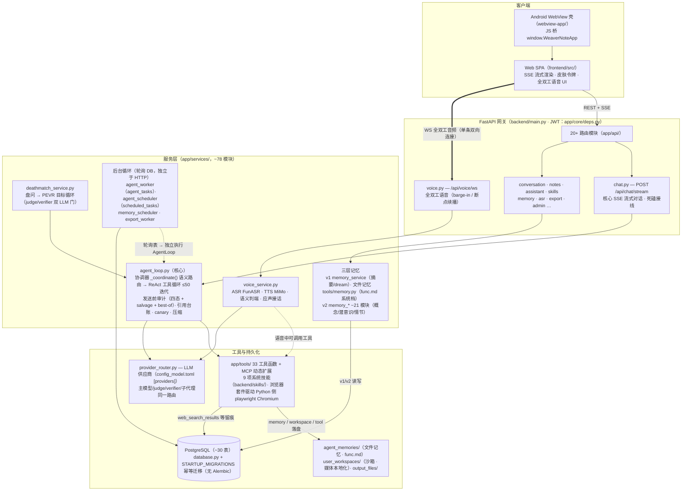
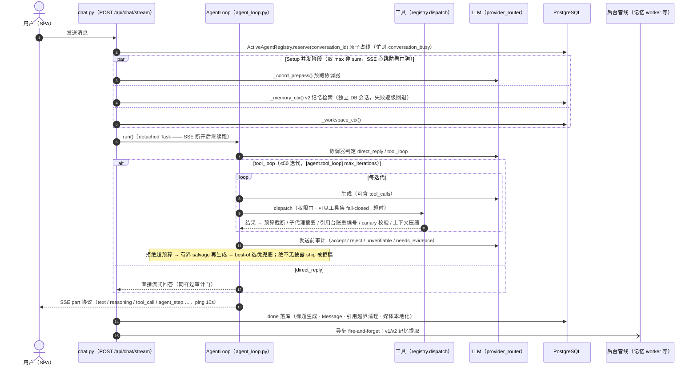

<!-- Copyright (c) 2026 Weave Thinker Contributors -->
<!-- SPDX-License-Identifier: Apache-2.0 -->

# Weave Thinker系统介绍

> 本文档基于当前代码库（`backend/`、`frontend/`、`webview-app/`）与 `AGENTS.md` 逐项核对后编写，描述系统的全部功能与关键设计实现。标注的文件路径与行号可交叉验证；配置默认值均来自 `backend/app/core/config.py` 与 `backend/config_model.toml`。

---

## 1. 项目概览

Weave Thinker 是一个**具备长期记忆、工具调用、多模态语音交互与自主目标执行能力**的个人 AI 助手平台（登录页品牌名「Weave Thinker」）。

| 维度 | 说明 |
|---|---|
| 形态 | Web 应用（桌面 + 移动自适应）+ Android WebView 壳 + 语音助理 |
| 后端 | FastAPI + Uvicorn + async SQLAlchemy 2.0 + PostgreSQL（pgvector 可选） |
| 前端 | Vue 3 + TypeScript + Vite + Pinia + marked/mermaid/echarts/katex |
| 移动端 | `webview-app/`（Android WebView 壳，JS 桥 `WeaverNoteApp`） |
| 模型提供方 | DeepSeek 主提供方 + 多 provider 路由（openai/anthropic/openrouter/mimo），ASR 走 DashScope FunASR，TTS 走 MiMo |
| 无 monorepo 工具 | pip（backend）+ npm（frontend），脚本全部收敛在 `scripts/` |

核心能力一览：

- **Agent 对话**：协调器语义路由 → ReAct 工具循环（≤50 轮）→ LLM 发送前审计 → 流式 SSE 渲染
- **33 个内置工具函数**（§3.4 全表，MCP 可再动态扩展）：联网搜索、浏览器、代码执行沙箱、终端、笔记、记忆、文件、委派子代理、后台任务、定时任务等
- **三层记忆**：v1 DB 摘要记忆、文件记忆工具（AGENT.md/USER.md/func.md）、v2 概念/潜意识/情节子系统
- **死磕模式**：盘问 → 目标循环（PEVR + judge/verifier 双 LLM 门 + 三级停滞升级）的自主长线任务模式
- **双工语音**：一条 WebSocket 实现全双工对话（流式 ASR + 语义 EoT + barge-in 打断 + 流式 TTS）
- **引用信息**：`[N]` 编号引用台账，防编造、防跨轮错配
- **后台任务 / 定时任务 / 技能系统 / 笔记与导出 / 权限审批 / 成本治理** 等企业级配套

---

## 2. 总体架构

### 2.1 运行时分层（流程图）



### 2.2 仓库结构（发行基线，带注释目录树）

```
weave-thinker/
├─ backend/
│  ├─ main.py                          # 入口：app 装配 + 启动事件序列 + 静态/SPA 投递
│  ├─ app/
│  │  ├─ api/                          # 20+ 路由模块（§3.2 全表）
│  │  ├─ services/                     # ~78 服务模块：AgentLoop/三层记忆/死磕/语音/导出（§3.3）
│  │  ├─ tools/                        # 33 个工具函数 + MCP 动态扩展（§3.4）
│  │  ├─ core/                         # config.py（双 TOML 合并）· deps.py（JWT）· provider_router.py
│  │  ├─ db/                           # database.py（模型 + 启动幂等迁移，无 Alembic）
│  │  ├─ schemas/                      # Pydantic 请求/响应模型
│  │  └─ vendor_js/                    # Mermaid/ECharts 等离线捆绑 JS（导出/渲染不依赖网络）
│  ├─ skills/                          # 9 项系统技能（SKILL.md 机读手册 + 捆绑脚本）
│  ├─ scripts/                         # 数据库维修/审计小工具（python -m scripts.<name>，默认 dry-run）
│  ├─ config.toml.example              # 随仓模板（真实 config.toml 由部署者自建，gitignored）
│  ├─ config_model.toml.example        # 模型配置模板（同上）
│  └─ agent_memories/func.md           # 随仓系统功能文档（memory 工具 system target 只读；fork 改写）
│      # 运行时自动创建（gitignored，勿手工提交）：audio_files/ · output_files/ · static/（前端构建产物）
├─ frontend/
│  ├─ index.html                       # SPA 入口（引用自托管字体，零第三方 CDN）
│  ├─ public/
│  │  ├─ fonts/                        # UI 字体自托管：108 woff2 + fonts.css + FONTS_LICENSE.md（OFL-1.1）
│  │  └─ icon.svg · logo.png · favicon.ico
│  ├─ src/                             # Vue 3 + TS（Composition API 全量；@ → src/）
│  │  └─ logo.png · logo.svg           # 仓库形象资产（README 首图引用；应用内 logo 用 LogoIcon.vue 内联 SVG）
│  ├─ e2e/                             # 2 个回归 specs（chat 为根基）+ 容错 global-setup
│  └─ playwright.config.ts · playwright.prod8158.config.ts   # dev(8159) / prod(8158) 双目标
├─ scripts/                            # project_build.sh · start/stop/restart/status.sh
│                                     # · dev_frontend.sh · apk_generate.sh
├─ webview-app/                        # Android WebView 壳（Gradle；keystore 随发布不随仓，构建脚本自动生成）
├─ docs/                               # ARCHITECTURE（本文）· API.md · SKINS.md · LICENSE-COMPLIANCE.md
├─ requirements/                       # 分平台部署指南（macos / ubuntu / windows / dependencies）
└─ README.md · AGENTS.md · CONTRIBUTING.md · LICENSE（Apache-2.0）
```

**发行基线里「不在」的事**（与主仓的差异面，部署者常见疑问）：
`backend/Fonts/`（CJK PDF 字体包——代码自动回退系统字体，装法见 requirements 各平台 §1）、
后端单元测试集与 `.pytest_cache`（§11）、运行时数据目录、真实 `config*.toml` 与证书
（模板 + 生成命令见 README 部署流程）、`keystore.jks`（`apk_generate.sh` 自动生成）、
内部设计资产与落地页。

---

## 3. 后端服务架构

### 3.1 入口与启动（`backend/main.py`）

- `app = FastAPI(title="Weave Thinker API")`，注册 20 个路由模块，SPA fallback 提供 `/app/frontend/*`（路径穿越防护）
- `__main__` 硬编码 `key.pem/cert.pem`（缺失静默回退 HTTP）；生产 `scripts/start.sh` 自动检测证书
- **startup 事件**依次：JWT secret 校验 → 运行时目录创建（audio_files/output_files/Fonts）→ `init_db()`（先 pgvector 探测 → `create_all`（pgvector 缺失时排除 8 张 memory v2 表）→ `STARTUP_MIGRATIONS` 幂等 SQL；建表在前因迁移含 `ALTER TABLE`，全新空库必须先有表）→ worker_instances 注册 + 30s 心跳 → 启动 `agent_scheduler`/`agent_worker`/`export_worker`/`memory_scheduler` → `stream_buffer_manager`/`ActiveAgentRegistry` 清理循环 + 孤儿任务恢复

### 3.2 路由模块（`backend/app/api/`）

| 模块 | 前缀 | 主要端点 |
|---|---|---|
| auth | `/api/auth` | 注册（建默认助手）、登录（JWT）、/me、修改本人偏好权限、登出 |
| chat | `/api/chat` | `POST /stream`（核心 SSE，4498 行）、`/stream/resume`、`/stream/status/{id}`、`/stream/stop/{id}`、`/permission/respond`、`/deathmatch/subgoal` |
| conversation | `/api/conversations` | 会话/分组 CRUD、跨助手移动、搜索、批量导出 zip、`/export-pdf` |
| assistant | `/api/assistants` | 助手 CRUD（自定义模型/子任务模型/thinking budget） |
| notes | `/api/notes` | 笔记本与笔记全 CRUD、搜索、批量导出/移动、quick 快捷笔记 |
| memory | `/api/memory` | v2 记忆：概念/梦境/澄清、遗忘、清空、成本治理；`/api/admin/memory` 迁移管理 |
| scheduled_tasks | `/api/scheduled-tasks` | 定时任务 CRUD + 手动触发 |
| agent_tasks | `/api/agent-tasks` | 后台任务 CRUD + **死磕盘问接口**（grilling 列表/单题回答/整轮回答） |
| export_tasks | `/api/export-tasks` | 导出任务（pdf/md/zip）创建/下载/取消 |
| voice | `/api/voice` | 语音会话列表/创建/消息、`WS /ws` 全双工主端点 |
| asr | `/api/asr` | 文件转写、热词管理、`WS /ws/transcribe/stream` 流式转写代理 |
| files / file_upload / image_upload | `/api/files` `/api/images` | workspace 下载（路径校验）、多文件上传解析（docx/pptx/xlsx/pdf/csv）、图片与音视频上传 |
| skills | `/api/skills` | 用户技能 CRUD + zip/文件夹上传（可执行文件安全扫描） |
| sessions / admin / config / system | — | 登录会话与聊天会话统计；用户管理（**无角色网关**）；provider 脱敏列表；`/api/system/capabilities` 能力清单 |

### 3.3 关键服务（`backend/app/services/`）

- **agent_service.py**：主 LLM/子任务 LLM 创建、系统提示词构建（注入共享长期记忆与身份）、AGENT.md/USER.md 身份提取
- **agent_loop.py**（6447 行）：AgentLoop 核心 —— 协调器 `_coordinate()`（LLM 语义路由）、ReAct 工具循环、DSML 工具调用解析、工具并行（`_PARALLEL_SAFE_TOOLS`）、发送前审计（`_audit_response` + reject budget + `_salvage_after_audit_budget`）、canary 遵循词、上下文压缩、迭代预算（默认 50）、死磕对接（judge/verifier/verdict 事件）
- **agent_worker.py**：轮询 `agent_tasks` 表（pending→claimed→running→终态，`FOR UPDATE SKIP LOCKED`），独立于 HTTP 执行 AgentLoop，结果写回会话 + 笔记，启动时强制恢复 claimed/running
- **agent_scheduler.py**：三循环 —— 每 15 分钟 v1 记忆摘要（`_run_memory`）、cron 定时任务执行（at-most-once）、保留期清理
- **memory_scheduler.py**：v2 记忆后台管线（潜意识扫描 + 巩固合并独立循环），与 agent_scheduler 的 v1 摘要互补
- **stream_buffer.py**：双层持久流式累加器（rendered_content_len 指针），断线重连 `to_replay()` 快照回放，500k 字符上限
- **provider_router.py**：默认 provider + `[providers]` 附加 provider，适配器（openai/anthropic/openrouter/mimo），`build_thinking_extra_body()` 按 provider 注入 thinking 参数
- **citation_ledger.py / canary_marker.py / tool_guardrails.py / pre_tool_gate.py / tool_result_budget.py / tool_result_digest.py / context_compressor.py / think_scrubber.py / error_classifier.py**：防幻觉与上下文治理链路
- **coordinator**：无独立模块，内嵌 `agent_loop.py::_coordinate`（本项目贯彻「语义判断留给 LLM，禁正则/硬编码分类器」原则，同原则见 schedule_parser、error_classifier、auditor）
- **media_localizer.py**：回复中远程媒体 URL 下载到用户 workspace（sha256 内容寻址 + index.json 去重 + 配额 + SSRF 门控），持久化前重写为相对路径
- **search_service.py**：多 provider 搜索接力（默认 exa 主 + bocha/firecrawl/tavily 备；serper 代码支持但默认未启用，`[web_search] provider/fallback_providers` 可配）+ 低质农场域名黑名单，来源逐条落 `web_search_results` 表
- **code_execution_service.py**：代码沙箱（子代理生成→执行→自动修复循环）
- **interactive_browser_service.py / browser_service.py**：交互式浏览器会话（navigate/click/type/scroll/screenshot/execute_js）与一次性抓取

### 3.4 工具系统（`backend/app/tools/`，33 个工具函数 + MCP）

注册机制：`registry.py` 单例 `ToolRegistry`，`register(name, toolset, schema, handler, check_fn, …)`，`dispatch()` 支持权限门、可见工具集 fail-closed、异步超时；启动时 `_discover_tools()` 自动导入 + `load_mcp_servers_from_config()` 注册 MCP 工具。

| 工具 | 功能 |
|---|---|
| web_search | 多 provider 联网搜索，返回轮次化结果（引用 [N] 编号源头） |
| browser / browser_navigate…execute_js / browser_screenshot | 一次性抓取 / 交互式会话全套操作 |
| execute_code | 代码沙箱执行（Python/Node），子代理修复循环，生成文件自动收集为下载卡片 |
| terminal | workspace 内终端命令（路径逃逸校验、超时、输出上限） |
| memory | 文件记忆读写（AGENT.md/USER.md/func.md，read/add/replace/remove） |
| notes | 笔记读写（list/get/create/update/delete） |
| workspace_read / workspace_glob / grep / diff / word_count | workspace 文件操作族 |
| provide_file | 把 workspace 文件显式挂成下载卡片 |
| pdf_export | 文本/笔记/对话渲染 PDF（WeasyPrint + CJK 字体 + 引用附录） |
| delegate_task | 子代理委派（深度≤2、独立 LLM、信号量并发） |
| background_task | 提交长时后台任务（agent_tasks 表，5h 超时） |
| schedule | 定时任务管理（NL 表达式 → 确定性 cron） |
| session_search | 历史会话全文搜索 |
| context7_resolve_library_id / context7_query_docs | context7 文档查询 |
| mixture_of_agents | MoA 聚合（默认关） |
| skill_view / skill_manage / skill_run_script | 技能系统（加载 SKILL.md 手册 / 创建用户技能 / 执行技能捆绑脚本） |
| MCP 工具 | 按 `[mcp]` 配置动态注册 |

**技能系统**：`backend/skills/` 9 个系统技能（web_search/browser/code_execution/echarts_chart/file_parsing/media_playback/docx_manipulation/pptx_manipulation/xlsx_manipulation，各含 SKILL.md），`skill_tools.py` 双源解析（系统技能优先 → 用户 DB `user_skills`+`skill_files`）并注入系统提示词；`skill_evolution_service.py` 在工具高频使用后建议沉淀新技能。

---

## 4. 核心消息处理管线

一条消息从发送到落库的完整链路（`chat.py::chat_stream` + `agent_loop.py`）。
总览时序（快照；以下步骤逐条展开）：



分步展开：

1. **接收与锁**：`POST /api/chat/stream` → `ActiveAgentRegistry.reserve(conversation_id)` 原子认领（占线返回 `conversation_busy` 错误）→ 历史消息经 `tool_history.rebuild_structured_history` 重建（OpenAI 风格 tool_calls 配对）
2. **Setup 并发阶段**（取 max 非 sum）：`_coord_prepass()`（预跑协调器）、`_memory_ctx()`（v2 记忆检索，独立 DB 会话）、`_workspace_ctx()` 并发执行；失败逐级回退（v1 共享记忆 → 无记忆）；期间 SSE 心跳防前端看门狗
3. **AgentLoop.run()**（detached asyncio.Task，asyncio.Queue 桥接事件，**SSE 断开后继续跑**）：
   - **协调器**：`_coordinate()` LLM 判定 `direct_reply`（直接回答）或 `tool_loop`（工具循环），输出 route/focus/expects_tools/search_required/creative_turn；direct_reply 走 `_stream_direct_reply`
   - **工具循环**：LLM 迭代 → DSML/原生 tool_calls 解析 → `registry.dispatch`（权限门/可见集/超时）→ 结果预算（tool_result_budget）→ 子代理摘要（tool_result_digest，8k+ 字符触发）→ **引用台账重编号**（digest 之前）→ canary 检查 → 上下文压缩（阈值 65%，保护首 3 条/尾 20k token）
   - **发送前审计**：`_audit_response` LLM 判定草稿是否回答最新用户消息（on-topic/不重复/有据可依）。**审计器证据设计**：遵循「信息完整性 > 省 token」原则——grounding 类工具结果（memory/workspace_read/web_search/browser）从 digest/budget 的磁盘存档（`【全文存档】`/persisted-output 路径）**读回全文**喂给审计器（`_build_audit_evidence`，token 预算 `[agent.audit] max_evidence_tokens=128000`，CJK 感知估算），先给确定性 `<evidence-ledger>` 台账再给全文；超预算才压缩/截断且**显式标注截断边界**。判定四态：`accept / reject / unverifiable / needs_evidence`——只有与可见证据矛盾或引用不存在的证据才判 reject（凭空编造），证据截断导致的"看不到"判 unverifiable（严禁误杀有据回答），证据缺失可补读判 needs_evidence（引导模型补读工具）；unverifiable/needs_evidence 走独立软计数（`soft_reject_limit=3`）**不消耗 reject_budget**；模板含诚实回答豁免（证据不足时"我无法获知"是合格回答）。拒绝计数 ≤ `reject_budget`（默认 2，search 轮 4）；**预算耗尽 → 去毒上下文有界 salvage 再生成一次（salvage prompt 允许诚实回答逃生口）、再审一次；salvage 仍失败（被拒/空/异常/超时）→ best-of 选优兜底：独立选优调用综合全部被拒草稿（`state.audit_rejected_drafts` 暂存，各带 verdict/problem/unsupported_claims）与审计意见产出完整独立自足（严禁差量式表述）的最终回答，过一次聚焦审计门（有界一次、不成环）；选优被拒/失败 → 确定性兜底（软拒优先→最早草稿 + 诚实警示前缀），最终回答不再显示「回答生成失败」。审计模板另含悬空引用规则（指代被拒草稿/上一版/审计过程 → reject）与数字核对硬性约束（心算不得作 reject 依据，心算不一致 → needs_evidence 建议工具重算）；审计调用不设 max_tokens 上限（provider 默认）+ bad_json 一次重试防截断 fail-open（`[agent.audit] draft_selection_enabled=true / selection_timeout_seconds=480 / salvage_timeout_seconds=240`）**，绝不无披露地 ship 被拒稿
   - **死磕模式**：DeathmatchManager 接管（见第 7 章）
4. **SSE 事件流**（`part_events.py` 将旧单键事件翻译为 F1-1 三类 part 协议）：

| 事件 | 含义 |
|---|---|
| `part_started` / `part_delta` / `part_updated` | 时间线部件协议（text/reasoning/tool_call/agent_step） |
| `content` / `reasoning_content` / `content_segment` | 正文增量 / 思考流（phase=final 标记）/ 完整段落 |
| `tool_call` / `tool_result` | 工具调用与结果（call_id/name/arguments/result/error） |
| `agent_step` | 结构化步骤（质量审计、压缩等系统步） |
| `search_progress` / `search_failed` | 搜索轮次进度 / 失败 |
| `iteration` | 迭代计数 current/max |
| `context_info` | 上下文 token 估算（头部徽章） |
| `attachments` | 累积下载卡片集 |
| `sub_agent_thinking` / `sub_agent_chunk` | 子代理思考 / 增量输出 |
| `task_progress` / `task_submitted` | 后台任务进度 / 已转后台 |
| `title_update` / `permission_request` | 会话标题自动命名 / 工具权限审批请求 |
| `deathmatch_verdict` | 死磕判定（含轮次直播） |
| `ping` / `error` / `done` | 心跳（10s）/ 错误（含 conversation_busy/superseded）/ 结束 |

5. **落库持久化**：done 时标题生成 → assistant Message（content/reasoning_content/tool_results/tool_calls JSON）→ `_transform_tool_loop_results`（附件提取：execute_code generated_files + provide_file 显式集 + scratch 过滤）→ `_sanitize_cited_content`（引用越界清理）→ `_localize_media_for_persist`（媒体本地化）；客户端断开走 `_spawn_interrupted_save`（独立 DB 会话 detached 保存）；`buffer.mark_complete(db_message_id)`

**韧性设计**：detached agent 任务（SSE 断不断跑）、StreamBuffer 双层重连、interrupted-save、worker_instances 心跳 + 孤儿恢复、`pg_advisory_unlock_all` 锁泄漏根治、pgvector 缺失降级、SIGHUP 配置热重载。

---

## 5. 完整功能清单

### 5.1 对话与助手

- 多助手（system_prompt、采样参数、**自定义模型** custom_api_* / provider_type / extra_body、子任务模型覆盖、thinking_budget）
- 会话/分组管理（跨助手移动、分组双归属、排序、批量删除/导出、搜索）
- 深链 `?conv=<id>` 直达；conversation_superseded 静默接管（新请求接管旧请求不弹错误）
- 消息编辑重发、重新生成、停止（部分回复落库）、草稿箱（drafts store）
- 标题自动生成（LLM，JSON 模式 + 重试 + 兜底）
- 上下文 token 徽章（CJK 感知估算 + localStorage 持久化 + 压缩前后对比）

### 5.2 记忆系统（三层并存，勿混淆）

1. **v1 DB 摘要记忆**（`memory_service.py`）：每用户每（服务器本地）日 `memory_summary` + `dream_summary`（`agent_memories` / `agent_dreams` 表），注入系统提示词（共享长期记忆 / 近期 dream / 可参考的记忆条目，`memory_max_items=12`）；调度器每 15 分钟 tick（**v2 runtime 启用时调度器跳过此每日生成**，改由 v2 提取管线 `memory_scheduler.py` 承担，见下）
2. **文件记忆工具**（`tools/memory.py`）：`agent_memories/{user_id}/{AGENT,USER}.md`（`\n§\n` 分隔），target=system 映射到**只读的 `func.md`**（系统功能自述，注入扫描 + 不可见 Unicode 防护 + 异步锁）；读操作无磁盘副作用。**func.md 第 6 章为版本记录**：以「与上一版的差异增量」形式保存、用产品视角描述（不含 commit 号/内部工程细节），更早历史不保留——每出一个新版本即以新增量整体替换该章
3. **v2 子系统**（~21 个 `memory_*` 模块，`config_model.toml [memory.*]`）：概念提取/衰减（weight+importance+stability+source_trust）、潜意识日志（复发检测 sim≥0.6 ×3 晋升）、情节记忆（merge_first_threshold 0.85）、多阶段检索（stage0-4：BM25+embedding → 关系扩展 → CE rerank → LLM 打分 → RRF 融合注入，预算 2000 token）、合并（20 概念/48h）、梦境、聚类、澄清（置信度≥0.8 自动应用）、多模态冷启动（Set-of-Mark OCR）、成本治理（计费 + 降级阶梯）、v1→v2 迁移管理

### 5.3 后台任务 / 定时任务

- **后台任务**：`background_task` 工具或 API → `agent_tasks` 表状态机，worker 3s 轮询（max_concurrent=3，10min 不活动检测；总超时 `[agent.background_tasks] total_timeout_seconds`，**代码默认 1h，线上 config.toml 配置为 5h**），完成后写回会话 + 默认笔记本建 Note + **语音主动播报**
- **定时任务**：`schedule` 工具创建（NL 表达式经 `schedule_parser.py` LLM 语义解析 → 确定性 cron），15s 轮询，`[SILENT]` 抑制投递，fail_count≥3 自动停用，手动 trigger
- **导出任务**：export_worker 2s 轮询（pdf/md/zip），产物落 `backend/output_files/`

### 5.4 笔记系统

笔记本/笔记 CRUD、WYSIWYG 编辑器（图片/音视频插入、mermaid/echarts/latex 预览）、快捷笔记、搜索、批量导出（PDF/MD）、笔记引用（`[note-ref:]` 内联正文）、raw_transcription 原始语音转写字段。

### 5.5 权限与安全

工具权限键（`terminal_execution`/`note_delete` 等）→ SSE `permission_request` → 用户前端审批 → `/permission/respond` 回填；死磕模式下带 permission_key 的工具自动放行（`registry.py` auto_allowed）；JWT + WebSocket token 认证；admin 用户管理（**当前无角色网关**：`/api/admin/*` 仅 `get_current_user`，任何登录用户可调用——已知待修项）。

### 5.6 导出

对话 PDF（WeasyPrint + mermaid/echarts SVG 渲染 + CJK 字体 + 引用附录）、批量 zip、笔记 PDF/MD；`pdf_export` 工具生成带引用附录的 PDF。

---

## 6. 双工语音实现详解（Duplex Voice）

### 6.1 总览

单条 WebSocket（`/api/voice/ws`，JWT query 参数认证）对应一个 `VoiceDuplexSession`（`voice_service.py:1337`），级联流水线：

```
流式 ASR → 轮转控制器（duplex + intent 子代理）→ 快速主代理 → 端点分段 MiMo TTS
```

设计参考 FireRedChat / DuplexCascade / semantic-VAD 的 `{idle, listen, think, speak, dual}` 决策状态机。会话启动后并行运行 4 个后台任务：`_asr_pipeline`（ASR 事件消费）、`_eot_watchdog`（判端）、`_tts_consumer`（播放）、`_responder`（轮次处理）。

### 6.2 消息协议

**客户端 → 服务端**：二进制帧（float32 LE 16kHz PCM，麦克风流）、`text`（文本输入）、`playback_progress`（播放位置 played_sec/total_sec）、`playback_drained`（播完）、`audio_proximity`（近/远场声学）、`interrupt`（打断按钮）、`stop`（关闭）。

**服务端 → 客户端**（关键事件）：`session`、`ready`、`state`（状态机迁移）、`asr_partial`/`asr_segment`（识别中间/完整结果）、`user_turn`/`user_turn_cancelled`、`assistant_text`、`speaking_start`/`speaking_end`、`interrupted`、`task_cancelled`、`playback_paused`/`playback_resumed`（含断点字符）、`deferred`（插话延后）、`backchannel`、`interjection`、`emotion`、`tool_notice`/`tool_call`/`tool_result`、`bg_task_notice`、`generation_cancelled`、`error`。

### 6.3 ASR（DashScope FunASR realtime 主 / MiMo 降级）

- FunASR：`wss://dashscope.aliyuncs.com/api-ws/v1/inference/` run-task 协议（`streaming: "duplex"`），sample_rate=16000、`max_sentence_silence=100ms`、`speech_noise_threshold=0.3`、`multi_threshold_mode_enabled`、heartbeat 保活（防 DashScope ~60s 静默断开）；上游断连自动重连（transcript 跨重连续接、发 `reconnecting` 事件），连续失败 5 次放弃并报 error
- **热词**：`user_asr_hotwords` 表 → DashScope 词库同步（ASRVocabularyService，vocabulary_id）或内联 hotwords JSON；`apply_hotword_phonetic_correction` 用 pypinyin 做同音字纠正
- **EoT 语义判端**（`_eot_watchdog`，100ms 轮询）：完整句（`。！？!?…～~` 结尾）静音 ≥`eot_silence_seconds=0.6s` 即 flush，另有 `eot_complete_grace_seconds=0.5s` 的 ASR 无活动宽限（区分句界停顿与真说完）、`eot_complete_max_seconds=2.0s` 硬上限兜底；不完整句静音 ≥`eot_semantic_probe_seconds=0.6s` 触发 LLM 语义判定器（`_classify_eot`，1.5s 超时 fail-open 开闸）——「完整」提前冲刷、「不完整」等 `eot_silence_incomplete_seconds=1.6s` 硬阈值（须覆盖 FunASR 长句 finalize 延迟）；播放暂停期探测缩短至 `eot_paused_probe_seconds=0.6s`
- 碎片合并 `_coalesce_fragments`：1.0s 等待（总上限 10.0s）——以上 EoT 数字均为 `[voice]` 配置值：代码默认 `eot_semantic_probe_seconds`=1.0s / `eot_silence_incomplete_seconds`=2.0s / `eot_complete_max_seconds`=3.0s，线上经 config_model.toml 覆盖为 0.6/1.6/2.0

### 6.4 Barge-in 打断与断点续播

三层防护：
1. **声学 onset 暂停**：播放中首个 ASR partial 立即暂停 TTS（先决：播放中、未暂停、长度 ≥`barge_in_onset_min_chars=3`、近场、非回声、不在 1.2s no-interrupt 窗口/2.0s 冷却内），同时并行预分类
2. **LLM 打断判定器**（`_classify_barge_in`）：`interrupt | defer | backchannel`，判据是「是否直接对助手说」（**换话题也算 interrupt**），注入最近 4 条上下文 + 播报尾 120 字 + 近/远场证据；无结果默认 backchannel
3. **Flush 时复用/重判**：`_pre_classify_reusable` 仅在文本匹配且完整时复用

**断点续播**：断点按「客户端 audible 位置（burst 锚点 + played_sec×字符速率）→ 片段比例 → 完成字符」三优先级估算 → snap 到安全边界（标点/空格/闭括号）→ **暂停期间预合成剩余文本**（`_resume_q`）→ 恢复时播放「快照 + 暂停期 delta」，并重锚 burst 时钟。`playback_resumed` 事件让前端重置客户端时钟。

**回声防护**：`_is_likely_echo`（字符 bigram 重叠 ≥0.6）+ 确定性噪音过滤（`_is_voice_noise` 纯标点/语气词/咳嗽）先于 LLM。

**停止词反射通道**（`_STOP_TASK_RE`）：长短语子串（不要继续/终止任务…）+ 短命令整句精确匹配（停/停下/等下…），取消进行中任务并 drain TTS 队列；工具循环每轮检查 `_task_cancelled`。

### 6.5 TTS 管线（MiMo mimo-v2.5-tts）

- 流式合成：POST `{base_url}/chat/completions`，SSE 解析 `delta.audio.data`（PCM16 **24kHz**），默认音色「冰糖」+ 风格指令
- **文本切段**：按 `，。！？；、…` 切（括号平衡保护），LLM 边流式边入队（dedup=True），首音频极快
- **prefetch 流水线**：播放当前段时只读扫描队首预启动下一段合成（硬背压 100 chunk ≈10s 音频）；**1× 实时发送节流**防 TCP 缓冲填满（~2MB≈40s）致尾部吞声
- **flush/pill 协议**：`_speak_text` 入 `{"flush": fut}` 等待播完（60s 超时）；`None` 毒丸退出；`_drain_tts_queue` 打断时清队列并作废 prefetch/resume_q
- **风格标签**：`clean_for_tts` 做 markdown→口语化（代码围栏/链接取 label/URL 剔除/表格剥除/单位换算），`(风格)` 仅保留白名单约 60 词（开心/温柔/磁性…，描述性短语最长前缀还原），`[声音标签]` 中非语音声音（笑/叹气/喘息）删除
- **重复段抑制**：`_SpokenDupWindow` 每轮 8 段窗口、≥6 规范化字符、播放完成才 record

### 6.6 上下文与插话

- **身份注入**：默认人格「Weave Thinker」（口语化简短、风格词白名单、禁动作/声音词）+ AGENT.md/USER.md 身份 + v2 记忆检索（10s 超时兜底 v1）+ 技能目录；保密规则禁止暴露模型名/提供商
- **插话**（agent 在用户说话时插嘴）：`_classify_interjection` 输出 `{should_interject, emotion, interjection_text(2-20字)}`，冷却 3s、每轮 ≤3 次、句子 ≥4 字；插话**立即 append 进 `_history`**（追问有据可查），不切换状态机，用户 EoT 优先切断
- 情绪机 `{calm, interested, excited, upset, broken}`，轮末单级衰减；`emotion` 事件驱动前端 orb 变色
- 语音轮次全部落到专用「语音助理」assistant 的会话（Agent 侧栏可见可继续文本对话）
- **后台任务播报**：`notify_voice_task_finished` → 活跃语音会话 `bg_task_notice` 事件 → 以 `[系统通知]` 消息让 LLM 主动播报结果并给后续选项（播报要点/导出 PDF/存笔记）

### 6.7 前端（`useVoiceDuplex.ts` + `VoiceChat.vue`）

麦克风采集：getUserMedia → AudioContext → **RNNoise WASM 神经网络降噪**（失败降级）→ ScriptProcessor(4096) → 单声道/16kHz → float32 帧发送（bufferedAmount<256KB 背压）；RMS 驱动 orb 呼吸；**近场门**（自适应噪声底，rms≥floor×4 连续 2 帧判 near）。播放：pcm16→float→重采样→AudioBufferSourceNode 链式调度，250ms 上报进度；orb 五态（idle/listen/think/speak/**dual 橙色**/error）+ 情绪调色 + 进度环 + 打断按钮。

---

## 7. 死磕模式实现详解（Deathmatch Mode）

### 7.1 总览

死磕模式 = 「**盘问（grilling）→ 目标循环（goal loop，PEVR）**」，核心 `deathmatch_service.py`（4912 行），由 `chat.py /chat/stream` 单条长 SSE 流驱动（非后台 worker），前端经 `deathmatch_verdict` 事件直播。DB 上 `conversations` 表带约 30 个 `deathmatch_*` 字段。

### 7.2 盘问阶段（Grilling）

- **触发**：`activate_grilling()` → status=grilling、`grilling_round=1`、总轮数 `max_grilling_rounds=3`、每轮 `questions_per_round=3` 题
- **问题生成**：`generate_grilling_questions()` 用 LLM 输出 JSON `{questions:[{id, question, recommendation, options}]}`（任务类型识别：文学创作/技术分析/创意设计/通用；递进式盘问——禁止重复已问角度、基于已有回答深挖）；temperature=0.3+attempt×0.2，最多 3 次重试；每个问题创建 `AgentTask(task_type="grilling")` 作为状态载体（**worker 明确排除 grilling 任务**，由用户经 API 回答）
- **回答**：单题 `complete_grilling_question` 或整轮 `submit_grilling_round`（校验全答，否则 incomplete）
- **轮次推进**：`_finish_grilling_round` → 记录 QA 历史（JSONB）→ round≥2 时 LLM 判定是否提前终止（`_should_continue_grilling`，失败 fail-open 保持固定轮数；轮数下限 2 轮）→ 结束则 `_synthesize_goal_from_answers()`（合成目标，空结果回退原始 query）→ 创作任务生成 bible 草稿 → `complete_grilling(goal)` → `generate_goal_plan()`
- **僵尸恢复**：`try_recover_stalled_grilling()` 处理残留（status=grilling 但无 pending、有 completed、round 已达上限）

### 7.3 目标循环（Goal Loop / PEVR）

- **进入**：status=active、`max_turns=config.deathmatch_max_turns`（代码默认 30，线上经 config_model.toml 覆盖为 9999）、启动墙钟段
- **继续提示词**（`get_continuation_prompt`）：步骤化模板（有 pending 步骤只做当前步：分块写入 ≤1500 字/禁 mv/rm/cp/禁提问）→ 通用模板 → 轮次引导（turn≤2 允许搜索；3-5 轮"别再搜索"；>5 轮"立即生成文件"）→ 计划摘要 + **C2 telemetry**（剩余墙钟/完成步骤/连续失败/停滞计数）→ D3 subgoals（用户中途追加验收标准，≤5 条展示）→ **PROGRESS.md 交接文件** → **圣经 spec**（创作任务）→ **continuity anchor**（上次 verifier 的 continuity_brief）→ 反思注入
- **重复检测**：前 500 字符比较，前缀 300 字符相同即判重复，≥2 次注入 `REPETITION_DETECTED_PROMPT`

### 7.4 Judge LLM（唯一完成权威）

- 判定：`done`（展示可验证产出/受阻）/ `continue`（解释/计划/声称完成无证据）/ `wait`（异步阻塞，默认 30s，钳制 5-3600）
- 调用：`_call_judge_llm` 的 judge **优先继承当前会话助手的模型客户端**（防止全局主模型裁判非主模型助手的会话），仅 `[deathmatch.judge]` 显式配置时覆盖；temperature=0，30s 超时（**超时不重试**，避免 judge 预算翻倍）；其余失败 **fail-open 返回 continue**
- DONE 要求 reason 引用具体证据（文件路径/命令输出）；「宁可保守 CONTINUE」

### 7.5 Verifier（PEVR 验证器）

`verify_step_outputs` 评估 6 方面：预期产出满足度、跨步骤衔接、重复冗余、**数据真实性（blocked）**、内容偏离（partial）、**圣经一致性**（OOC/称呼/epistemic leak/kill list，仅创作任务）。输出 `{status: complete|partial|blocked, completed_steps, issues, retry_instruction, requires_file, continuity_brief}`。

- **快照轮（首轮）**：首次验证只抓工作区快照不判定（并写 bible 文件）
- **A1a 证据门**：verifier 判 complete 时，若步骤 `requires_file`（缺省 True=fail-secure）必须有本轮 **>100 字节新文件**，否则保持 in_progress + issue「证据门拦截」
- **进度检测**：新完成步骤或文件 mtime 变化 → progress；信息收集类工具（workspace_read/web_search/browser/memory/notes，≥200 字）与短验证工具（word_count/grep）走 **sha1 hash 新颖性**（hash 历史 200 条）；**Spin 检测**：连续 ≥3 轮无可见文本（<50 字）且进展仅来自工具新颖性 → 强制 progress=False
- 步骤完成时：后台异步 `_evolve_bible()`（抽取 2-6 条 canon facts 追加 `bible/evolution.md`）+ 写 output_summary/output_files（≤10 个）

### 7.6 三级 stall 升级（`_handle_stall`）

计数 `deathmatch_verify_failures`，**仅连续 no-progress 累加**（有进展即重置）：
- **Tier 1**（<8）：反思记录 + 重规划（`replan`，无进展才重规划；首个 no-progress 轮 replan=False；全 done 计划快速升级）→ 继续
- **Tier 2**（≥`stall_partial_threshold=8`）：status=partial_complete、冻结墙钟、收集 deliverables、返回带 pending 步骤+issues+建议的终止消息
- **Tier 3**（≥`stall_hard_threshold=16`）：`trigger_human_gate()` 写结构化 JSON 报告（reason/completed/pending/last_verification/suggested_actions）→ 人工介入

判断入口 `evaluate_after_turn`：verifier=blocked → stall；complete+计划全 done 但 judge 说未完成 → **不算 stall**（有进展继续并重置，无进展才重规划）；partial+no-progress → stall。

### 7.7 judge/verifier 冲突仲裁（`_reconcile_completion`）

judge=done 但计划未完成或 verifier 非 complete → LLM 仲裁（`completion_reconcile`，25s 超时）→ `finalize|continue|stall`；LLM 失败保守 continue。

### 7.8 完成检测与交付物

- **唯一完成权威是 judge**（正则完成检测不参与判定）
- done 路径：status=done、剩余步骤全部标 done（UI 正确显示）、`generate_final_summary_table()` 生成「任务完成汇总表」（含 degraded 单步计划检测）
- **Deliverables 三级收集**：① 仅 `provide_file` 显式文件；② 工具输出中提取的文件名（`_filter_cited_deliverables`——文件名必须出现在最终回复/判定理由中，≥6 字符含扩展名）+ 编号家族扩展（ch01..ch50 稠密无缺口）；③ V1 全量附件兜底；全部排除 scratch/task_ 中间产物

### 7.9 暂停 / 恢复 / 取消 / 墙钟

- `pause`（status=paused + 冻结墙钟）、`resume`（active + **累计墙钟不重置**）、`resume_from_partial`（不重置 verify_failures，重复停滞继续升级）
- `deactivate`：status=inactive、丢弃 bible 草稿
- **WAIT 停靠**：judge=wait → 退还本轮 turn 计数、冻结墙钟、等用户下条消息自然恢复
- **C4 spin 守卫**：连续 2 轮空回复且无工具输出 → partial_complete
- **墙钟预算**：`used + 当前段 ≥ max(配置, max_turns×60)`（动态下限：每轮至少 60s）；超限 → human_gate
- **上下文压缩**：跨轮摘要 `deathmatch_context_summary` + 交接文档（目标/计划进度/continuity/反思/telemetry，硬上限 4000 字）；消息 >80 条强制压缩
- **意图分类**：一轮完成后新消息 `NEW_ROUND|DISCUSS|CLARIFY`（快速路径 + LLM，失败回退 DISCUSS）
- **异常兜底**：`_persist_deathmatch_failure` 在取消/异常路径持久化可见 paused+原因（身份检查防覆盖新运行）

### 7.10 与传统模式共享/独享

**死磕独享**：响应审计豁免（自己的 judge 当门）、工具循环护栏豁免（force_final_answer/consecutive/web_search 限制/搜索需求门/tool_nudge）、coordinator 跳过（不注入 focus）、预算不终止（judge 决定重置）、工具权限自动放行、屏蔽 background_task、更激进压缩、中间内容实时流式、独立迭代预算 999。

**共享**：canary 遵循词、上下文压缩器、工具 digest、citation ledger、permission_manager、StreamBuffer、会话锁、SSE 心跳。

### 7.11 API 与前端

- 发起/停止/暂停/恢复：`POST /api/chat/stream` 的 `deathmatch_mode` + `deathmatch_action`（start/stop/pause/resume）；恢复靠发消息（「继续」等 ≤12 字指令 resume；DISCUSS 消息暂停；done 后 NEW_ROUND/CLARIFY 重新盘问）
- `POST /api/chat/deathmatch/subgoal`：追加验收标准（≤500 字、总数 ≤20）
- 盘问：`GET /api/agent-tasks/grilling/{conversation_id}`、`POST /grilling/{task_id}/answer`、`POST /grilling/{conversation_id}/round-answer`
- 前端：ChatInput 死磕开关 → ChatArea 状态条（盘问进度/计划 x/y/paused/human_gate 报告）→ 盘问卡片（选项按钮 + textarea）→ 完成后自动发送「目标已明确，请开始执行」踢起目标循环 → 轮次直播（verdict store 轮询 + plan 步骤）→ done 汇总消息 + 下载卡片

---

## 8. 对话引用信息实现详解（Grounded Citations）

### 8.1 核心不变式

> 系统拥有 URL→[N] 映射，模型只输出被交付的整数；持久化前校验，幻觉/越界/跨轮歧义的 [N] 被机械移除。（`citation_ledger.py` 头部注释）

### 8.2 数据流

```
web_search 返回每轮 1 起编号的 formatted（tools/web_search.py:44）
  → AgentLoop._apply_citation_ledger（agent_loop.py:1730）
      CitationLedger.register_hits：normalize_url 去重（去 fragment/尾斜杠，query 保留）
      → 分配轮内全局单调 id（首个出现顺序，绝不复用）
      → 重写 formatted 为全局编号列表（1. 标题 / URL / 摘要）——在 digest 摘要化之前
  → 模型按全局编号在正文写 [N]（search-demand 指令要求）
  → 持久化前 _sanitize_cited_content（chat.py:660）
      _transform_tool_loop_results（chat.py:413）按同一 normalize_url 去重拍平 results[]
        （位置即 id-1，与台账对齐）
      → build_ledger_from_tool_results 重建台账 → verify() 分 cited/unknown
      → sanitize_async()（LLM 判定：编造引用删除 / 枚举用法「[3]个要点」保留，20s 超时，
         失败保守保留全部）—— 6 条持久化路径全覆盖：
         chat.py:2998（正常完成）/ chat.py:3106（SSE 取消、循环已完成的自保存）/
         chat.py:3409（中断保存）/ chat.py:4254（legacy resume 直存 _completed）/
         agent_worker.py:465 / agent_scheduler.py:621
  → 前端渲染
```

### 8.3 前端渲染

- **`addCitationSuperscripts`**（useMarkdown.ts:1139）：把 `[N]` 替换为 `<sup class="citation-ref">`，**validSet 过滤**——越界/未引用的 [N] 保持原文（流式诚实）
- **`renumberCitationSuperscripts`**：按 data-cite-index 重编号
- **`displayedToolResults`**（MessageBubble.vue:910）胶囊三层守卫：无真实搜索结果不显示（LLM 自编 bib 不得上徽章）→ 正文未引用不显示 → bib 条目与真实结果 **CJK 加权模糊匹配**（权重 3），匹配不到即幻觉来源，不给 UI 徽章
- 点击上标/胶囊 → 预览弹窗（previewedResult 按编号反查）
- 流式阶段：`StreamMarkdown.vue` 剥参考段仅留 [N] 角标，无台账时剥掉全部 [N]

### 8.4 对话保存为笔记 / 导出时的引用重建（reference 专项处理）⭐

把对话消息**保存为笔记**（或导出 PDF/zip）时，引用信息有一套专门的「去旧段 → 重编号 → 重建参考来源」管线（`ChatArea.vue`）：

1. **入口**：`handleSaveToNotebook`（ChatArea.vue:1197）——选中消息 → 每条助手消息（带 `tool_results` 时）执行引用重建 → `**用户**`/`**助手**` 角色头 + `---` 分隔拼装 → `notesStore.createNote` 写入笔记（标题 `对话记录: …`）；导出走同一套 `processMessageContentForExport`（L989，handleDownloadSingle/Bulk）
2. **剥除旧参考段**：`stripExistingReferenceSection`（L1154）——把消息末尾原有的 `参考文献|参考资料|References|Sources|Reference` 段（含前置 `---` 分隔线）整体剥离，避免叠加
3. **计算重编号映射**：`computeCitationIndexMap`（L1172）——扫描正文**实际引用**的 `[N]`（`\[(\d{1,2})\]`，正文无引用时回退全量结果编号），按升序映射为连续 1,2,3…
4. **正文重编号**：`renumberInlineCitations`（L1159）——正文内联 [N] 按映射改写，**代码围栏/行内代码保护**（split 后围栏段跳过）；无映射的编号原样保留
5. **重建 `**参考来源**` 段**：`buildCitationsSection`（L1114）——从 `tool_results.results[]` 按映射后的新编号生成 `[N] "title." *domain.* url (发布日期).` 行（域名去 `www.`；发布日期从 URL 路径 `/(2026)/(04)/(12)/` 等模式提取为「2026年4月12日」），无结果或解析失败返回空串
6. **图片附件补充**：`attachments` 中 type=image 的路径以 `` 追加到正文尾，随笔记一起保存
7. **后端镜像**：agent 主动调用 `pdf_export` 工具时，`pdf_exporter.py::_append_citations_section`（L50-106）以同一「剥旧段 → 收集已用编号（无则全量）→ 顺序重编号 → 代码围栏保护重排正文 → 追加参考段」逻辑生成 PDF 参考附录

这样保存的笔记/导出的 PDF 中，引用编号始终与文末参考来源一一对应、稠密无缺口，且与对话内真实搜索结果绑定（不保留模型自编的 bib 条目）。

### 8.5 边界与盲点

- browser 工具**不产生** [N]（`_apply_citation_ledger` 只处理 web_search）
- digest 摘要化后经 `【全文存档】` 路径恢复原始 results（`_recover_digested_search`），证据不丢
- 语音 TTS 路径不剥离 [N]（仅删声音标签；展示层 `strip_voice_tags` 会剥）；语音 tool_results 拍平不去重
- 死磕模式结果同样走 `_sanitize_cited_content`（同一 `_completed` 链路）；死磕的 `_filter_cited_deliverables` 是「交付文件点名筛选」，与 [N] 无关

---

## 9. 数据库（PostgreSQL，`backend/app/db/database.py`）

关键表：`users`、`assistants`、`conversation_groups`、`conversations`（含全部 `deathmatch_*` 字段 ~30 列）、`messages`（content/reasoning_content/tool_results/tool_calls JSON + search_vector 全文索引）、`notebooks`/`notes`、`user_sessions`/`chat_sessions`、`user_agent_states`、`agent_memories`/`agent_dreams`、`memory_concepts`/`memory_clusters`/`concept_cluster_members`/`concept_relations`/`memory_clarifications`/`subconscious_log`/`memory_episodes`/`memory_llm_calls`、`user_workspaces`、`user_asr_hotwords`、`user_skills`/`skill_files`、`agent_tasks`/`scheduled_tasks`/`export_tasks`、`worker_instances`。

迁移：Alembic 已装未用，`STARTUP_MIGRATIONS` 幂等 SQL 启动时执行（`backend/app/db/migrations.py`）；修复助手脚本在 `backend/scripts/`。

---

## 10. 部署与脚本（`scripts/`）

| 脚本 | 用途 |
|---|---|
| start.sh / stop.sh / restart.sh / status.sh | PID 文件生命周期（nohup + chatllm.pid + chatllm.log），SSL 自动检测 |
| project_build.sh | 前端生产构建 → 清空 `backend/static/` → 拷贝 dist |
| dev_frontend.sh | Vite dev server（8159，PID 文件 + 日志）供 Playwright E2E |
| apk_generate.sh | Android SDK/JDK 定位 + SERVER_URL 注入 + gradle assembleRelease → `apk/` |

---

## 11. 测试

- **前端 E2E**：Playwright（`frontend/e2e/` 仅 2 个回归 specs（baseline_smoke、chat），其中 `chat.spec.ts` 为根基；默认配置 baseURL http://127.0.0.1:8159，需后端 8158 + `scripts/dev_frontend.sh` 起的 dev server；`playwright.prod8158.config.ts` 直接打 8158 生产构建；全局 setup 仅在存在种子脚本/venv 时运行，缺失自动跳过）
- **后端**：本开源发行不含后端单元测试集（维护者仓内部保留）；后端改动验证走 CONTRIBUTING「测试要求」的可运行脚本 + 前端 E2E
- **浏览器 chromium 双份**：服务端 agent 浏览器工具走 Python 侧 playwright（`python -m playwright install chromium`），前端 E2E 走 npm 侧（`npx playwright install chromium`）——两侧版本不同、chromium 构建 revision 不一致，装全功能需各装一次（见 requirements 各平台文档 §9）

---

*本文档与代码的对应关系：核心模块均标注了文件路径；如有出入以代码为准。*
